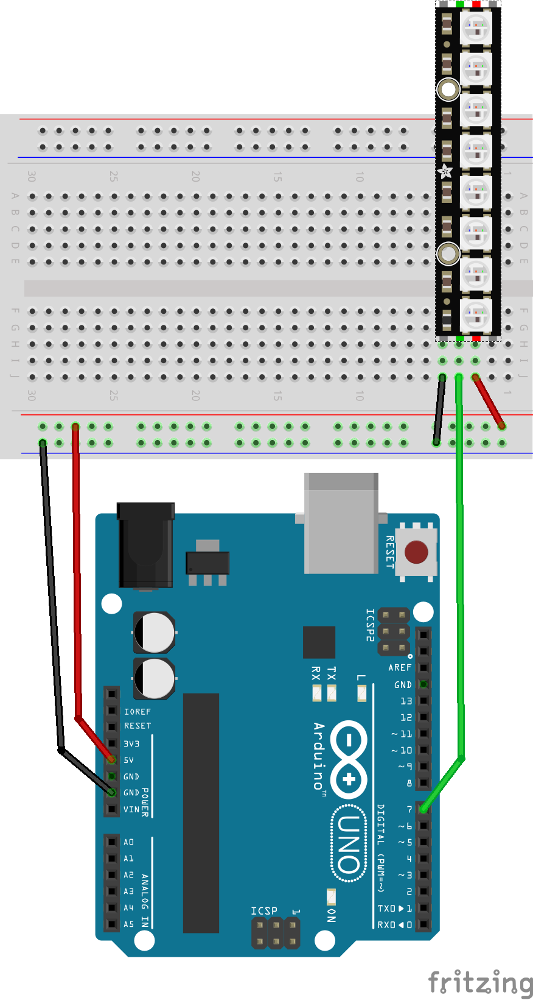

# PixelStrip
Arduino library for [NeoPixel](https://learn.adafruit.com/adafruit-neopixel-uberguide/the-magic-of-neopixels) / WS2812B LED animations.  This library extends  [FastLED](https://fastled.io/).

## Installation
The `PixelStrip.zip` file can be created by the `build.sh` script (on either Mac or Linux).  To install into your Arduino IDE:

* Sketch > Include Library > Manage Libraries and then install the FastLED library.
* Sketch > Include Library > Add ZIP Library and then add the `PixelStrip.zip` file.

## Trivial Example - Blinking the onboard LED

The Arduino has an LED on the board, which you can turn on or off, by setting to HIGH or LOW.  This code is built into the Arduino IDE and can be retrieved from the File menu at:  File > Examples > 01.Basics > Blink.

```c++
void setup() {
  pinMode(LED_BUILTIN, OUTPUT);
}

void loop() {
  digitalWrite(LED_BUILTIN, HIGH); 
  delay(1000);       
  digitalWrite(LED_BUILTIN, LOW);
  delay(1000);
}
```

This Blink program is very useful because it verifies that the basic hardware and software is working.  If you ever reach a point there the board isn't doing anything, you can always load in the Blink program to verify that your hardware is wired and powered, that your IDE is working and files are being delivered through USB.

## Simple Example - Blinking a NeoPixel

```c++
#include <PixelStrip.h>

const int PIN = 7;
const int NUM_PIXELS = 8;
const int BRIGHTNESS = 128;
int state = 0;

PixelStrip *strip = new PixelStrip((new NEOPIXEL<PIN>), NUM_PIXELS);

void setup() {
  strip->setBrightness(BRIGHTNESS);
  strip->clear();
  strip->setup();
  strip->setTimeout(1);
}

void loop() {
  if (strip->isTimedout()) {
    uint32_t color = ((state++) % 2 == 0) ? RED : GRAY;
    strip->setPixelColor(0, color);
    strip->show();
    strip->setTimeout(500);
  }
}
```

### Arduino wiring



## Matrix Example

```c++
#include <PixelStrip.h>

const int PIN = 7;
const int MAX_X = 8;
const int MAX_Y = 8;
const int BRIGHTNESS = 128;
const int TIME = 20;

PixelStrip *strip = new PixelStrip((new NEOPIXEL<PIN>), MAX_X, MAX_Y, MATRIX_TOP | MATRIX_LEFT);

void setup() {
  strip->setBrightness(BRIGHTNESS);
  strip->setup();
}

void loop() {

  // Blink the zero pixel as RED
  for (int i = 0; i < 8; i++) {
    strip->setPixelColor(0, RED);
    strip->show();
    delay(TIME);
    strip->clear();
    strip->show();
    delay(TIME / 2);
  }
  delay(500);

  // Blink the origin pixel as GREEN
  for (int i = 0; i < 8; i++) {
    strip->setPixelColor(0, 0, GREEN);
    strip->show();
    delay(TIME);
    strip->clear();
    strip->show();
    delay(TIME / 2);
  }
  delay(500);

  // Blink pixels in sequence as YELLOW
  for (int p = 0; p < MAX_X * MAX_Y; p++) {
    strip->setPixelColor(p, YELLOW);
    strip->show();
    delay(TIME);
    strip->clear();
    strip->show();
    delay(TIME / 2);
  }
  delay(500);

  // Blink each row as BLUE or WHITE, top to bottom and left to right
  for (int y = 0; y < MAX_Y; y++) {
    uint32_t c = (y % 2 == 0) ? BLUE : WHITE;
    for (int x = 0; x < MAX_X; x++) {
      strip->setPixelColor(x, y, c);
      strip->show();
      delay(TIME * 2);
      strip->clear();
      strip->show();
      delay(TIME);
    }
  }

  delay(500);
}
```

You can use this program to test your matrix hardware, and verify that all the options are correct, e.g. `MATRIX_TOP`, `MATRIX_LEFT`, etc.  If the options are correct, then the green origin pixel will be on the upper left corner and the BLUE/WHITE pixels will move top to bottom and left to right.

## TODO
* Create a `print` function like in NeoMatrix.  Also maybe an icon/sprite library
* Add some interesting matrix animation examples
